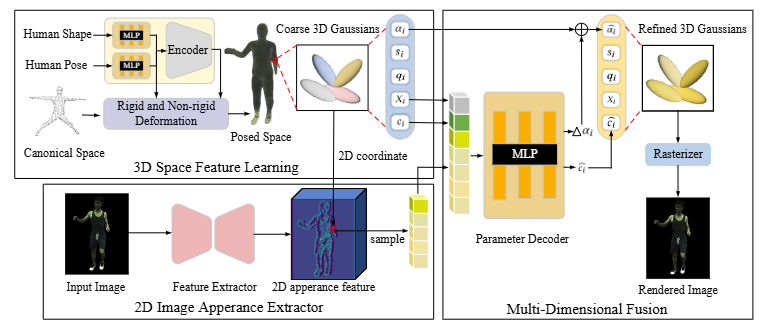

# Image Appearance-Guided Multi-Dimensional Gaussian Splatting for Human Avatar Reconstruction
* Official Implementation of our AF-Avatar.

# Introduction
Below is the overall pipeline of AF-Avatar.


# Getting Started

## Prerequisites

```
$ conda env create -f environment.yml
```

# Directory
## Root  
The `${ROOT}` is described as below.  
```  
${ROOT}  
|-- body_models  
|-- dataset
|-- models  
|-- utils   
```  
* `body_models` contains SMPL params.
* `data` contains data loading codes and soft links to images and annotations directories.  
* `models` contains the main code.  
* `utils` The utils directory contains utility modules for camera handling, dataset management, general operations, graphics rendering, loss computation, and spherical harmonics, providing foundational support for core functionalities.  


# Running AF-Avatar

## Train  
To train new networks from scratch, run
```bash  
# ZJU-MoCap
python train.py dataset=zjumocap_377_mono
# PeopleSnapshot
python train.py dataset=ps_female_3 option=iter30k pose_correction=none
```  

## Evaluation
To evaluate the method for a specified subject, run
```bash  
# ZJU-MoCap
python render.py mode=test dataset.test_mode=view dataset=zjumocap_377_mono
# PeopleSnapshot
python render.py mode=test dataset.test_mode=pose pose_correction=none dataset=ps_female_3
``` 

